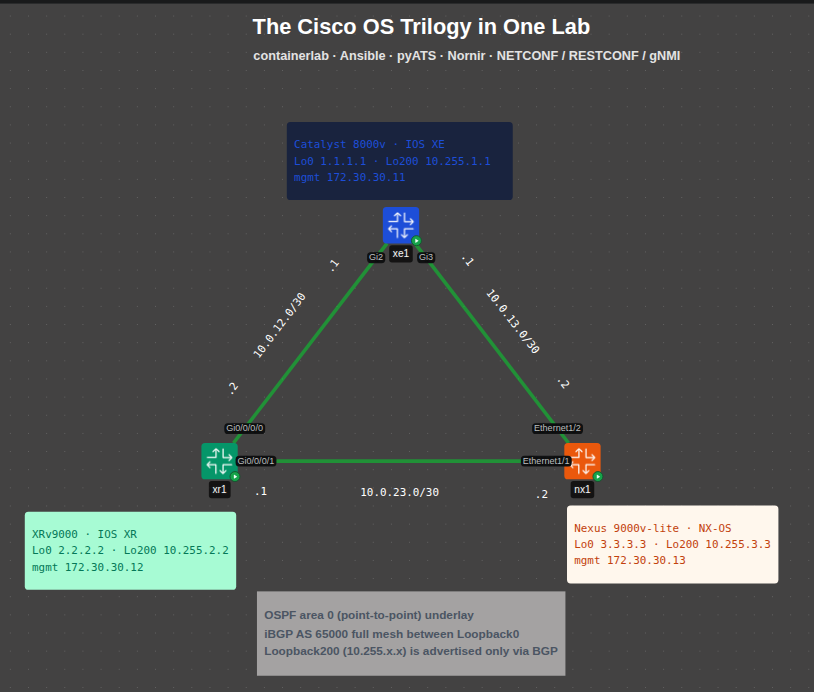

# Automation with containerlab across Cisco IOS XE, IOS XR and NX-OS

[](https://github.com/Thantoeaungait/Automation_with_containerlab_across_Cisco_ios_xe_xr_nx-os/actions/workflows/lint.yml)
[](LICENSE)

**A production-style automation workflow, rehearsed on a Cisco lab.** One containerlab topology runs
a Catalyst 8000v, an XRv9000 and a Nexus 9000v side by side. Everything is driven from a single YAML
source of truth with secrets in an encrypted vault: Ansible configures OSPF and iBGP, logins go
through TACACS+, pyATS validates against intent, changes are checkpointed and rolled back on failure,
Nornir audits and detects drift, and a failure test breaks a link to prove the network reroutes.
The whole lifecycle — **deploy → AAA → configure → validate → change → validate → prune → drift →
audit → APIs → failure test → destroy** — runs with one command and leaves a run manifest behind.

<p align="center">
  
</p>

> **About this project.** I started this lab while learning network automation from scratch (v1.x).
> Version 2.0 rebuilds it around production practices — vault, single source of truth, central AAA,
> rollback, failure testing, an approval-gated pipeline — so the workflow can be practised end to end.
> It is still a lab, not a framework to point at real devices: [docs/PRODUCTION.md](docs/PRODUCTION.md)
> lists what is covered and the gaps to close first. Every problem hit along the way is documented in
> [docs/TROUBLESHOOTING.md](docs/TROUBLESHOOTING.md). Feedback from experienced engineers is very welcome.

> **Cisco images are not included.** They are licensed software; you must obtain them yourself.
> See [docs/IMAGES.md](docs/IMAGES.md).

---

## Contents

- [What you'll practice](#what-youll-practice)
- [Tested versions](#tested-versions)
- [Requirements](#requirements)
- [Quick start](#quick-start)
- [Production approach](#production-approach)
- [Pipeline stages](#pipeline-stages)
- [How each tool connects](#how-each-tool-connects)
- [Secrets, single source of truth and AAA](#secrets-single-source-of-truth-and-aaa)
- [Safe changes, failure tests and observability](#safe-changes-failure-tests-and-observability)
- [Removing configuration and detecting drift](#removing-configuration-and-detecting-drift)
- [Making a change](#making-a-change)
- [Repository layout](#repository-layout)
- [Configuration reference](#configuration-reference)
- [Known limitations](#known-limitations)
- [Before real devices](#before-real-devices)
- [Documentation](#documentation)

## What you'll practice

- **Lab as code** — the topology is generated from the SoT and kept in Git; every deploy is identical.
- **Single source of truth** — `sot/fabric.yml` holds the intent. The topology and every tool's inventory
  are derived from it, and pyATS derives the expected state (OSPF neighbors, reachability) from the same file.
- **Secrets out of Git** — credentials, the TACACS+ key and certificate passwords in an ansible-vault file.
- **Central AAA** — TACACS+ authentication and accounting with local fallback and a local-only console.
- **Changes as data** — a change is a small YAML overlay in `sot/changes/`, validated before you keep it.
- **Day-0 vs day-1** — bootstrap enables model-driven interfaces over SSH, then day-1 configures the network.
- **Idempotent configuration** — resource modules for interface state; templates that match running-config.
- **Underlay + overlay routing** — OSPF carries the loopbacks, iBGP (full mesh) carries extra prefixes.
- **Removing what isn't declared** — `prune` deletes loopbacks that exist on a device but not in the SoT.
- **Drift detection** — two complementary methods: SoT vs device (Ansible check mode) and golden config diff.
- **Multiple automation interfaces** — Ansible, Nornir/Netmiko, pyATS/Genie, NETCONF, RESTCONF, gNMI.
- **Safe changes** — checkpoint, apply, validate, automatic rollback on failure; pre/post state diff.
- **Failure testing** — break a link with netem and measure reroute and recovery.
- **A real pipeline** — readiness polling, JUnit reports, run manifest, automatic teardown, optional
  self-hosted runner with an approval gate.

## Tested versions

| Component | Version |
|---|---|
| Host OS | Ubuntu 26.04 LTS |
| containerlab | 0.79.0 |
| Catalyst 8000v (IOS XE) | 17.13.01a — `vrnetlab/cisco_c8000v:17.13.01a` |
| XRv9000 (IOS XR) | 24.3.1 — `vrnetlab/cisco_xrv9k:24.3.1` (built with `INSTALL=true`) |
| Nexus 9000v-lite (NX-OS) | 9500v-lite 10.5.5.M — `vrnetlab/cisco_n9kv:9500-lite-10.5.5.M` |
| TACACS+ server | Marc Huber's tac_plus — `lfkeitel/tacacs_plus:latest` |
| Python (venv) | 3.12 via uv |

Other versions will probably work; if your image tags differ, set them in `lab.env` (see below).

## Requirements

| | Minimum |
|---|---|
| vCPU | 8 (12 recommended) |
| RAM | 32 GB — XRv9000 ~16 GB · C8000v ~5 GB · N9Kv-lite 6 GB + host |
| Disk | 80 GB free |
| Virtualization | `/dev/kvm` (bare metal, or nested virtualization enabled) |

Host software (installed by `scripts/00-host-setup.sh`): Docker, QEMU/KVM, containerlab, gnmic, uv, shellcheck.

## Quick start

```bash
git clone https://github.com/Thantoeaungait/Automation_with_containerlab_across_Cisco_ios_xe_xr_nx-os.git
cd Automation_with_containerlab_across_Cisco_ios_xe_xr_nx-os

# 1. Host preparation (once) — then log out and back in
./scripts/00-host-setup.sh

# 2. Build the images (once) — put the Cisco files in ~/cisco-images first, see docs/IMAGES.md
N9KV_VARIANT=lite ./scripts/01-build-images.sh c8000v n9kv xrv9k
docker images | grep -Ei 'c8000v|n9kv|xrv9k'

# 3. Only if your tags differ from "Tested versions": create lab.env
cp lab.env.example lab.env && nano lab.env
make env                       # shows what containerlab will receive

# 4. Python toolchain (Python 3.12 venv + Ansible collections)
make deps

# 5. Secrets: vault password (openssl rand -base64 32) + encrypted credentials
make vault-init

# 6. Run the whole pipeline (TACACS+ and the failure test are opt-in)
make ci                        # core pipeline
TACACS=1 FAILOVER=1 make ci    # everything, as in the v2.0.0 reference run
```

The first run takes a while: XRv9000 needs 10–20 minutes to boot. `make wait` polls until all nodes are ready.
Back up the vault password file `make vault-init` creates (`~/.config/mvauto/vault-pass`): without it
the secrets cannot be decrypted.

**Run stages yourself** (the lab stays up; nothing is destroyed automatically):

```bash
make deploy wait           # start nodes and wait for SSH
make bootstrap configure   # enable APIs, push the configuration
make validate              # check OSPF and reachability
make ssh-xr                # log in to a node (ssh-xe, ssh-nx)
make destroy               # stop the lab
```

To keep the lab after the pipeline (passed or failed): `KEEP_LAB=1 make ci`.

## Production approach

v2.0 practises the workflow a production automation setup depends on: intent in one place, no
secrets in Git, every change validated and reversible, central AAA, failure tested on purpose, and
evidence from every run. [docs/PRODUCTION.md](docs/PRODUCTION.md) maps each practice to the command
that exercises it, shows the reference pipeline run, and lists the gaps to close before real devices.
How-to guides: [phase 1](docs/PRODUCTION-PHASE1.md) (vault, SoT, TACACS+, TLS, pre/post checks) and
[phase 2](docs/PRODUCTION-PHASE2.md) (rollback, failure test, telemetry, Batfish, NetBox, self-hosted CI).

## Pipeline stages

Stages run by `make ci` in this order (`scripts/ci.sh`):

| `make` target | Tool | What it does |
|---|---|---|
| `deploy` | containerlab | Starts the topology; clears stale SSH host keys for the lab IPs |
| `wait` | Nornir | Polls until each node returns an SSH banner and accepts a login |
| `bootstrap` | Ansible | Day-0: enables NETCONF, RESTCONF, gNMI/gRPC (detects the XR management VRF) |
| `tacacs` (`TACACS=1`) | Ansible | AAA via TACACS+ on IOS XE and NX-OS, local fallback, local-only console |
| `tacacs-test` (`TACACS=1`) | Nornir | Logs in with a TACACS-only account; prints server access/accounting logs |
| `configure` | Ansible | Day-1: addressing + OSPF rendered from `sot/fabric.yml` |
| `validate` | pyATS/Genie | OSPF FULL neighbors per node + full-mesh pings of OSPF loopbacks → `reports/validation-baseline.xml` |
| `validate-bgp` | pyATS/Genie | iBGP sessions Established per node + reachability of BGP-only prefixes → `reports/validation-bgp.xml` |
| `change` | Ansible | Applies a change set (default `sot/changes/loopback100.yml`) |
| `validate-change` | pyATS/Genie | Re-validates including the change → `reports/validation-change.xml` |
| `prune` | Ansible | Removes loopbacks not declared in the SoT (Loopback0 is protected); `prune-check` previews |
| `validate LABEL=after-prune` | pyATS/Genie | Back to baseline after the prune → `reports/validation-after-prune.xml` |
| `drift-check` | Ansible | Check mode: fails if any device differs from what the SoT would render |
| `audit` | Nornir | Config backups to `backups/` + compliance rules → `reports/audit.json` |
| `apis` | ncclient · requests · gnmic | NETCONF, RESTCONF and gNMI smoke tests |
| `failover-test` (`FAILOVER=1`) | containerlab netem · Netmiko | Breaks the SoT failover link, measures reroute and recovery |
| `destroy` | containerlab | Tears the lab down (skipped with `KEEP_LAB=1`) |
| (`ci.sh` exit) | Python | `reports/run-manifest.json`: commit, image IDs, host, per-stage result and duration, report checksums |

Not in the pipeline, run on demand: `dry-run` (`--check --diff`), `safe-change`, `checkpoint` /
`rollback`, `pre-check` / `post-check` / `state-diff`, `golden` / `drift`, `pki`, `batfish`,
`netbox-sync`. `make help` lists all targets, including `lint`, `render`, `env`, `inspect` and `graph`.

## How each tool connects

| Tool | Transport | xe1 (IOS XE) | xr1 (IOS XR) | nx1 (NX-OS) |
|---|---|---|---|---|
| Ansible `network_cli` | SSH :22 | ✔ | ✔ | ✔ |
| Nornir + Netmiko | SSH :22 | ✔ | ✔ | ✔ |
| pyATS / Genie | SSH :22 | ✔ | ✔ | ✔ |
| NETCONF (ncclient) | SSH :830 | ✔ | ✔ | ✔ (native-model fallback) |
| RESTCONF (requests) | HTTPS :443 | ✔ | — not implemented on IOS XR | ✔ via NX-API |
| gNMI (gnmic) | gRPC :57400 | — see limitations | — see limitations | ✔ TLS, self-signed |

Links in `topology/lab.clab.yml` use the interface names you see on each device (`Gi2`, `Gi0/0/0/0`,
`Ethernet1/1`), so the topology file, the SoT and `show` output all match.

Credentials come from the vault (`make vault-view`). The template keeps the containerlab defaults for
the automation accounts (xe1 / nx1 `admin`, xr1 `clab`) and generates random values for the TACACS+
key, the TACACS-only `netops` account and the certificate password.

## Secrets, single source of truth and AAA

- **Vault:** all credentials, the TACACS+ key and the PKCS#12 password live in `secrets/vault.yml`,
  encrypted with ansible-vault (`make vault-init`, `make vault-edit`). Nothing secret is in Git.
- **One SoT:** `sot/fabric.yml` describes devices, platforms, management IPs and services. The
  containerlab topology is generated from it (`make topology`), and Ansible, Nornir, pyATS and the API
  scripts all read it through `lab/sot.py` / `ansible/inventory/sot.py`.
- **TACACS+:** a tac_plus container in the lab; `make tacacs` points device AAA at it with local
  fallback and a local-only console; `make tacacs-test` proves it with a TACACS-only account and,
  on failure, prints the server's access log and the device's AAA state.
- **TLS:** `make pki` creates a lab CA and device certificates.

Details: [docs/PRODUCTION-PHASE1.md](docs/PRODUCTION-PHASE1.md).

## Safe changes, failure tests and observability

- `make safe-change` takes a checkpoint, applies the change, validates, and rolls back on failure.
- `make failover-test` breaks a link with netem and measures reroute and recovery.
- Optional telemetry stack (gnmic → Prometheus → Grafana), Batfish analysis without routers,
  NetBox sync, and a self-hosted GitHub runner workflow.

Details: [docs/PRODUCTION-PHASE2.md](docs/PRODUCTION-PHASE2.md).

## Removing configuration and detecting drift

Ansible's default behaviour only **adds** configuration. If you delete a loopback from the SoT, it
stays on the device. This lab handles that in two ways:

```bash
make change            # add Loopback100 everywhere
make prune-check       # preview: "remove ['loopback100']"
make prune             # delete loopbacks that are not in the SoT (Loopback0 is always protected)
make prune KEEP_CHANGE=1   # keep the change set's loopbacks
```

Drift is detected with two complementary methods:

| Method | Compares | Catches | Misses |
|---|---|---|---|
| `make drift-check` | SoT ↔ device (Ansible check mode) | Changes to lines the automation manages | Config the automation doesn't manage |
| `make golden` + `make drift` | Saved config ↔ current config | **Any** change, e.g. a manual `ip ospf cost` | Why it changed |

Try it: `make golden`, add `ip ospf cost 50` on xe1 by hand, then run both checks. Only the golden
diff sees it, because the templates don't manage OSPF cost. Remediate with `make configure prune`
(and remove unmanaged lines by hand, or bring them into the SoT).

## Making a change

```yaml
# sot/changes/my-change.yml
changes:
  xr1:
    loopbacks:
      - { name: Loopback200, ipv4: 200.0.0.2/32 }
```

```bash
make render CHANGE=sot/changes/my-change.yml           # preview the generated config (no lab needed)
make change CHANGE=sot/changes/my-change.yml
make validate-change CHANGE=sot/changes/my-change.yml  # now also expects 200.0.0.2 to be reachable
```

To change the permanent design (links, addressing, nodes), edit `sot/fabric.yml`; validation adapts automatically.

## Repository layout

```
.
├── topology/            lab.clab.yml (generated) · configs/ (xr1.cfg; tac_plus.cfg rendered, git-ignored) · *.annotations.json
├── sot/                 fabric.yml (single source of truth) · changes/*.yml (change sets, incl. bad-overlap.yml)
├── lab/                 sot.py: loads the SoT + vault for every Python tool
├── secrets/             vault.example.yml (vault.yml and pki/ are created locally, git-ignored)
├── ansible/             inventory/sot.py (dynamic) · playbooks (bootstrap, configure, prune, tacacs, checkpoint, rollback)
│                        templates (bootstrap, day1, aaa)
├── nr/                  Nornir: wait_ready.py · backup_and_audit.py · drift.py · tacacs_test.py · common.py (SoT inventory)
├── validation/          validate.py · validate_bgp.py · failover.py (intent-derived checks, JUnit)
├── api/                 netconf_get.py · restconf_get.py · gnmi_check.sh
├── scripts/             host setup · image build · ci.sh · gen_topology · render_* · vault-init · pki · run_manifest
│                        batfish_check · netbox_sync · tacacs-check
├── docs/                PRODUCTION*.md · ARCHITECTURE.md · TROUBLESHOOTING.md · IMAGES.md · topologyimages/
├── .github/             lint workflow · lab workflow (self-hosted runner) · issue and pull request templates
├── lab.env.example      optional local overrides (copy to lab.env)
└── Makefile             entry point for every stage
```

## Configuration reference

All optional. Set them in `lab.env` or on the command line (`make ci GNMI_SKIP=none`).

| Variable | Default | Purpose |
|---|---|---|
| `C8KV_IMAGE`, `XRV9K_IMAGE`, `N9KV_IMAGE` | tested versions above | Local image tags |
| `C8KV_MEMORY`, `C8KV_SMP` | `4096`, `1` | C8000v sizing (17.16 nested: `8192`, `2`) |
| `N9KV_MEMORY`, `N9KV_SMP` | `6144`, `2` | N9Kv sizing (full image: `10240`, `4`) |
| `GNMI_SKIP` | `xe1 xr1` | Nodes excluded from the gNMI test; `none` tests all |
| `TOPO` | `topology/lab.clab.yml` | Topology file |
| `CHANGE` | `sot/changes/loopback100.yml` | Change set for `change` / `validate-change` |
| `KEEP_LAB` | `0` | `1` keeps the lab after `ci.sh` |
| `TACACS` | `0` | `1` adds the TACACS+ stages to `ci.sh` |
| `FAILOVER` | `0` | `1` adds the failure test to `ci.sh` |
| `ANSIBLE_VAULT_PASSWORD_FILE` | `~/.config/mvauto/vault-pass` | Vault password file (e.g. a CI secret) |
| `KEEP_CHANGE` | unset | `1` makes `prune` / `prune-check` keep the loopbacks of `$(CHANGE)` |
| `WAIT_TIMEOUT` | `1800` | Seconds `make wait` polls |

## Known limitations

- **gNMI on xe1:** this C8000v image (unlicensed) has no `gnxi` / `gnmi-yang` CLI. Bootstrap tries both and continues.
- **gNMI on xr1:** vrnetlab puts the XRv9000 management interface in VRF `clab-mgmt`; in testing, the
  gRPC server was not reachable there. NETCONF works (bootstrap enables it in the management VRF).
  Details and what was tried: [TROUBLESHOOTING](docs/TROUBLESHOOTING.md#xrv9000-gnmi-and-the-management-vrf).
- **RESTCONF on xr1:** IOS XR does not implement RESTCONF.
- **One lab per host:** fixed management subnet `172.30.30.0/24` and node names.
- **Validation timing:** right after configuration, OSPF and BGP may still be converging; validation
  retries, and a rerun normally passes.
- **Prune scope:** `prune` only manages loopbacks. Other unmanaged config (interfaces, OSPF settings) is
  reported by `make drift`, not removed.
- **TACACS+ on IOS XR:** off by default (`services.tacacs.apply_to`); check the task-group attributes
  for your release first.
- **TLS verification:** `make pki` creates certificates, but installing them is manual and
  `pki.verify_with_lab_ca` is off until you do.

## Before real devices

The workflow is production-style; some lab shortcuts are not. Unverified SSH host keys, a lab CA,
the vault key in a home directory, shared privilege-15 automation accounts, a permit-all TACACS+
group, additive configuration and all-at-once rollout must be replaced first. The full list, with
what production needs instead: [docs/PRODUCTION.md](docs/PRODUCTION.md#gaps-before-real-devices).

## Topology diagram

`topology/lab.clab.yml.annotations.json` holds the diagram layout for the containerlab VS Code
extension (TopoViewer): node positions, colours, the title, per-node info boxes and subnet labels.
Open the topology in VS Code to see it. To refresh `docs/topologyimages/topology.png`, adjust the layout in
TopoViewer and take a screenshot (see TROUBLESHOOTING for why SVG export may lose the text).

## Documentation

- [docs/IMAGES.md](docs/IMAGES.md) — obtaining and building images, file naming rules
- [docs/ARCHITECTURE.md](docs/ARCHITECTURE.md) — design decisions and trade-offs
- [docs/PRODUCTION.md](docs/PRODUCTION.md) — approach to production: coverage, reference run, gaps before real devices
- [docs/PRODUCTION-PHASE1.md](docs/PRODUCTION-PHASE1.md) — vault, single SoT, TACACS+, TLS, pre/post checks
- [docs/PRODUCTION-PHASE2.md](docs/PRODUCTION-PHASE2.md) — rollback, failure tests, telemetry, Batfish, NetBox, self-hosted CI
- [docs/TROUBLESHOOTING.md](docs/TROUBLESHOOTING.md) — every failure hit while building this lab, with fixes
- [CONTRIBUTING.md](CONTRIBUTING.md) · [SECURITY.md](SECURITY.md) · [CHANGELOG.md](CHANGELOG.md)

## License

[MIT](LICENSE) © 2026 Than Toe Aung. Cisco and related product names are trademarks of Cisco Systems, Inc.;
this project is not affiliated with Cisco. See [NOTICE](NOTICE).
